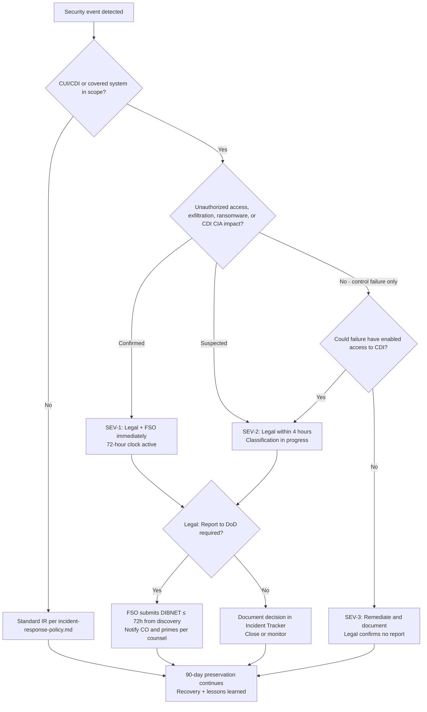

# DFARS 252.204-7012 — Incident Reporting Procedure

Operational procedure for cyber incident handling and reporting when [ORGANIZATION_NAME] processes **Covered Defense Information (CDI)** or is subject to DFARS clause 252.204-7012.

> **Disclaimer:** This is an operational template, not legal advice. Reporting obligations depend on your contract, agency, and incident facts. Consult legal counsel and your contracting officer. SOC2 Sentinel does not file reports on your behalf. Verify current DIBNet guidance at [https://dibnet.dod.mil](https://dibnet.dod.mil).

## Purpose

Ensure timely detection, containment, investigation, classification, preservation, and reporting of cyber incidents affecting covered contractor information systems and CDI/CUI.

## Scope

Applies when:

- Contract includes DFARS 252.204-7012 or equivalent flow-down
- Systems store, process, or transmit **CUI** or **CDI**
- Incident affects a **covered contractor information system** as defined in the clause

## Roles

| Role | Responsibility |
|------|----------------|
| **Incident Commander (IC)** | Declares incident severity; coordinates response |
| **Security Operations** | Triage, forensics, evidence preservation |
| **Legal / Counsel** | Determines reporting obligations |
| **Facility Security Officer (FSO)** | DIBNET submission coordination (if applicable) |
| **Executive Sponsor** | Approves external communications |
| **Contracting Officer Rep (COR)** | Receives contractual notifications per counsel guidance |
| **Program / Contracts** | Prime/subcontractor flow-down notifications |

## Definitions (simplified)

- **Cyber incident:** Actions that compromise confidentiality, integrity, or availability of covered systems or CDI
- **Covered contractor information system:** System that processes, stores, or transmits CDI
- **Covered Defense Information (CDI):** Unclassified controlled technical information or other information described in DFARS 252.204-7012
- **Rapid reporting:** Notify DoD within **72 hours** of **discovery** for qualifying incidents per clause and current DoD guidance
- **Discovery:** When someone with authority to bind the organization knows—or reasonably should know—that a cyber incident occurred (confirm exact standard with Legal)

---

## Incident classification criteria

Legal makes final classification. Use these criteria for initial triage.

### Tier A — Presumptive DFARS report (engage Legal immediately)

| Indicator | Examples |
|-----------|----------|
| Confirmed unauthorized access to CDI/CUI | Exfiltration, unauthorized download, ransomware encryption of CUI stores |
| Compromise of covered contractor information system | Malware, webshell, or admin takeover on CUI-scoped VPC/account |
| Credential compromise with CUI access path | Stolen admin creds to CUI bucket, API keys with CDI read access |
| Loss of confidentiality, integrity, or availability of CDI | Data destruction, integrity tampering, extended outage of CUI system |

### Tier B — Reporting assessment required (Legal within 4 hours)

| Indicator | Examples |
|-----------|----------|
| Suspected unauthorized access to CUI environment | Anomalous `GetObject` on CUI bucket; unconfirmed IOCs |
| Security control failure on covered system | Logging disabled (`log_aggregator` red); encryption removed (`encryption_status` red) |
| Phishing targeting CUI personnel | No confirmed credential compromise yet |
| Supply chain / vendor breach affecting your CUI | Vendor notification under assessment |

### Tier C — Unlikely DFARS report (document; remediate)

| Indicator | Examples |
|-----------|----------|
| Near-miss or blocked attack | WAF block; failed login attempts only |
| Non-CUI system compromise | Dev sandbox with no CDI path |
| Control failure on non-covered system | Logging gap on marketing site |
| Low-severity phishing with no compromise | User reported; credentials unchanged |

### Tier D — Not a cyber incident for DFARS (standard IT issue)

| Indicator | Examples |
|-----------|----------|
| Planned maintenance outage | Documented change ticket |
| User error without security impact | Accidental file delete with backup restore |
| Availability issue without compromise indicators | ISP outage |

**When in doubt, classify as Tier B until Legal decides.**

---

## 7-step 72-hour workflow

The **72-hour clock starts at discovery** (UTC). All times below are targets from discovery.

| Step | Name | Target time | Owner | Key actions |
|------|------|-------------|-------|-------------|
| **1** | Detect & declare | 0–1 hour | Security Ops / IC | Open incident ticket with UTC timestamp; page IC for Tier A/B; preserve volatile evidence |
| **2** | Preserve evidence | 1–4 hours | Security Ops | Initiate 90-day hold (see below); chain of custody; snapshot logs/images before eradication |
| **3** | Contain | 1–4 hours | Platform Eng | Isolate hosts; revoke credentials (`iam_access_review` scope); block IOCs; avoid destructive wipe before snapshot |
| **4** | Classify | 4–24 hours | Legal + IC | Apply classification criteria; determine CDI/CUI impact; decide reporting obligations |
| **5** | Report externally | ≤ 72 hours | FSO + Legal | DIBNet submission if required; CO notification; prime/sub flow-down per counsel |
| **6** | Recover | 24 hours – 14 days | Platform Eng | Clean restore; validate `encryption_status` and `log_aggregator`; MFA reset |
| **7** | Lessons learned | ≤ 10 business days | IC | Post-incident review; POA&M updates; tabletop gaps; detection rule improvements |

### Step 1 — Detection (0–1 hour)

1. Alert sources: SIEM, `log_aggregator` findings, EDR, employee report, customer notification, vendor advisory
2. On-call validates alert; opens **Incident Ticket** with UTC discovery timestamp
3. If CUI/CDI system potentially affected, notify IC and Legal immediately
4. Assign preliminary tier (A/B/C/D) pending Legal confirmation

**Sentinel hook:** Critical `log_aggregator` or `encryption_status` failures on CUI-scoped resources escalate to SEV-1.

### Step 2 — Evidence preservation (1–4 hours; hold 90 days minimum)

See **90-day preservation** section below. Do not delay containment solely for preservation—but snapshot before eradicate.

### Step 3 — Containment (1–4 hours)

1. IC assigns severity (SEV-1 to SEV-4)
2. Isolate affected hosts, revoke compromised credentials (`iam_access_review` export for scope)
3. Preserve logs and disk images—document chain of custody
4. Disable attacker access paths; avoid destructive actions before forensic snapshot

### Step 4 — Assessment & classification (4–24 hours)

1. Determine if incident involves **CDI/CUI** or covered system
2. Identify: entry vector, dwell time, data accessed/exfiltrated, accounts affected
3. Legal assesses DFARS 7012 reporting threshold using classification criteria
4. Document timeline in Incident Record and `data/notion-import/incident-reporting-tracker-seed.csv`
5. Complete draft fields in `docs/templates/dibnet-report-template.md` if reporting likely

### Step 5 — Reporting (within 72 hours of discovery)

When Legal determines reporting is required:

1. **DoD Cyber Crime Center (DC3) / DIBNET** — submit via prescribed mechanism per current DoD instructions
2. **Contracting Officer** — notification per contract and counsel template
3. **Affected customers/prime contractors** — per flow-down obligations (see **Flow-down** section)
4. **Subcontractors** — if your incident affects their CDI or vice versa, coordinate per contracts

**Required information typically includes** (use `dibnet-report-template.md`):

- Company name and CAGE code
- UEI (if applicable)
- 24-hour contact name, phone, email
- Contract numbers affected
- Incident summary and current operational status
- Compromise indicators (store IOCs in secure annex—not email)
- Systems affected (high level)
- Corrective actions initiated
- Estimated impact on CDI/CUI

> **Important:** Reporting channels and forms change. Verify current guidance at [https://dibnet.dod.mil](https://dibnet.dod.mil) and DoD CIO publications.

### Step 6 — Recovery (24 hours – 30 days)

1. Restore from clean backups; verify `encryption_status` on restored stores
2. Reset credentials; force MFA re-enrollment where needed
3. Enhanced monitoring for 30 days minimum
4. Customer/status communications per Legal-approved holding statements

### Step 7 — Lessons learned (within 10 business days)

1. Post-incident review with IC, Legal, Security Ops, Executive Sponsor
2. Update POA&M, SSP, and detection rules
3. Schedule tabletop remediation items
4. Retain incident records per `data-retention-disposal-policy-v2.2.md` and legal hold

---

## Decision tree — Is DFARS reporting required?

---

## 90-day evidence preservation

DFARS and DoD guidance require preserving images and relevant reporting for **at least 90 days** after discovery (confirm current rule text with Legal). [ORGANIZATION_NAME] adopts **90 days minimum** unless legal hold extends longer.

### Preservation trigger

Initiate hold at **Step 2** for all Tier A and Tier B incidents. Tier C at IC discretion.

### What to preserve

| Category | Examples | Collection method |
|----------|----------|-------------------|
| **Audit logs** | CloudTrail, Azure Activity, GCP Audit Logs | Export to immutable storage; `log_aggregator` bundle |
| **EDR / endpoint** | Process trees, file hashes, quarantine files | EDR console export |
| **Network** | VPC flow logs, firewall logs, packet captures | Log archive / mirror |
| **Identity** | IAM snapshots, access key metadata | `iam_access_review` export |
| **Application** | App logs, API gateway logs | Centralized logging |
| **Communications** | Incident tickets, war-room chat, email threads | Ticketing export |
| **Forensic** | Disk/memory images of affected systems | Forensic toolkit |
| **Configuration** | Security group rules, bucket policies at time of incident | IaC state + `config_drift` snapshot |
| **Sentinel evidence** | `evidence/[DATE]/[CONTROL]/report.json` | Git-ignored local archive |

### Storage requirements

- **Encrypted** at rest (align with `encryption-key-management-policy-v2.3.md`)
- **Access-controlled** — IR team and Legal only
- **Immutable** where possible (S3 Object Lock, WORM)
- **Chain of custody log** — who collected, when, hash values, storage location
- **Not in public Notion** or unencrypted email

### Preservation roles

| Role | Task |
|------|------|
| **Security Ops** | Execute technical collection |
| **Legal** | Issue/extend legal hold |
| **IT** | Suspend auto-deletion on affected log buckets |
| **Compliance** | Track hold end date (discovery + 90 days minimum) |

### Release

Legal approves release after 90-day minimum and when no active investigation/litigation requires extension.

---

## DIBNet submission fields (reference)

Use `docs/templates/dibnet-report-template.md` for the full redacted template. Commonly requested field groups:

1. **Organization** — legal name, CAGE, UEI, contacts
2. **Contracts** — numbers, programs, prime/sub relationships
3. **Timeline** — discovery UTC, suspected compromise UTC, key response milestones
4. **Classification** — incident type, CDI/CUI impact, covered system determination
5. **Technical summary** — systems affected (redacted), accounts, entry vector, IOC annex reference
6. **Impact** — operational and customer impact
7. **Response actions** — containment, eradication, recovery status
8. **Corrective actions** — planned remediations with owners
9. **Preservation attestation** — what is held and where
10. **Submission record** — DIBNet confirmation, CO notification dates

**Do not** email live IOCs or unredacted CDI descriptions. Use secure channels defined by DC3.

---

## Flow-down obligations

### When you are a **subcontractor**

- DFARS 252.204-7012 flow-down from prime may require you to report cyber incidents affecting CDI to DoD **and** notify the prime within contractual timelines (often aligned with 72-hour DoD reporting)
- Notify **prime contractor security point of contact** per contract exhibit when Legal determines incident qualifies
- Coordinate DIBNet submission with FSO; do not assume prime will report on your behalf
- Document notifications in Incident Reporting Tracker

### When you are a **prime contractor**

- Flow down 252.204-7012 (and NIST 800-171 requirements) to subs handling CDI
- Establish subcontractor incident notification requirements in SOW/security exhibit
- Upon receiving sub notification, assess impact to **your** CDI and reporting obligations independently
- Maintain vendor/subcontractor contact list for incident coordination

### When you use **cloud/SaaS providers**

- Provider breach notifications do not replace **your** DFARS assessment
- Review vendor DPAs for incident SLAs (`docs/templates/vendor-security-questionnaire.md`)
- Customer-side misconfiguration (your responsibility) may still trigger reporting if CDI is affected

### Flow-down notification checklist

| Party | Notify? | When | Owner | Template |
|-------|---------|------|-------|----------|
| DoD / DIBNet | If Legal requires | ≤ 72h discovery | FSO | `dibnet-report-template.md` |
| Contracting Officer | If Legal requires | Per counsel | Contracts | Counsel template |
| Prime contractor | If sub + contract requires | Per contract | Program Mgr | Flow-down exhibit |
| Subcontractors | If your incident affects their CDI | Per contract | Program Mgr | Counsel template |
| Customers (commercial) | If tenant data affected | Per DPA/contract | Executive Sponsor | Holding statement |
| Cyber insurance | If policy requires | Per policy | Legal | Carrier portal |

---

## Severity matrix

| Severity | Criteria | DFARS consideration |
|----------|----------|---------------------|
| SEV-1 | Confirmed CDI breach or ransomware on covered system | Legal engaged immediately; 72-hour clock |
| SEV-2 | Suspected unauthorized access to CUI environment | Legal within 4 hours |
| SEV-3 | Security control failure without confirmed access | Remediate; report if counsel determines required |
| SEV-4 | Near-miss / contained reconnaissance | Document; typically no DFARS report |

---

## Evidence preservation (long-term)

Preserve for minimum **3 years** for general incident records (or per legal hold)—distinct from the **90-day** forensic hold above:

- CloudTrail / audit logs (`log_aggregator` evidence bundles)
- EDR timelines
- Network packet captures (if available)
- Incident ticket and chat transcripts
- Forensic images
- DIBNet submission confirmation (redacted)

Store in access-controlled, encrypted repository—not public Notion pages.

---

## Communication rules

- **Do not** discuss incident details in public channels
- **Do not** admit liability in customer emails without Legal review
- **Do** use pre-approved holding statements for external inquiries

---

## Tabletop exercise requirement

Conduct at least **one annual tabletop** including:

- Discovery of exfiltration from CUI bucket
- 72-hour reporting timeline walkthrough
- DIBNET submission roles (dry run)
- Flow-down notification to prime contractor

Record in `docs/templates/tabletop-test-record.md`. Document attendees and gaps in POA&M.

---

## Relationship to SOC2 Sentinel

| Tool role | Limitation |
|-----------|------------|
| Detects logging gaps, encryption failures | Does not detect active intrusions alone |
| Provides audit artifacts post-incident | Not a managed SOC or IR retainer |
| Supports evidence retention metrics | Does not submit DIBNET reports |
| `iam_access_review` scopes compromised accounts | Point-in-time export only |

---

## Related documents

- `policies/incident-response-policy.md`
- `docs/templates/dibnet-report-template.md`
- `docs/templates/tabletop-test-record.md`
- `docs/templates/threat-hunting-playbook.md`
- `data/notion-import/incident-reporting-tracker-seed.csv`

## References

- DFARS 252.204-7012 (Safeguarding Covered Defense Information and Cyber Incident Reporting)
- NIST SP 800-171 Rev 2
- DoD CMMC program documentation
- Internal: `monitoring-alerting-policy.md`, `system-monitoring-policy-v2.0.md`

---

*Procedure version 2.3 — SOC2 Sentinel Toolkit.*