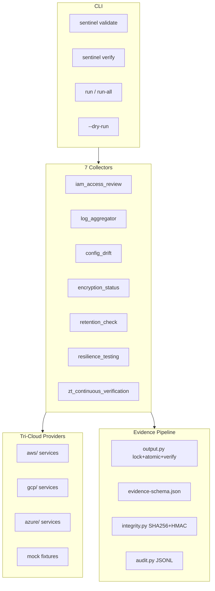

# SOC2 Sentinel v2.5 — Complete Production Build (Full Scope)

## Objective

Deliver **v2.5.0** as a finished, sellable, audit-grade product. **Every item** from the security audit, **every stub eliminated**, **full tri-cloud live implementations** for all 7 collectors. Mock is the only intentional non-cloud path (explicit offline demo).

This is not phased, not staged, not a simulation of human sprint planning—it is the **complete scope of work** that ships together as one release.

---

## What v2.4 already fixed (do not regress)

- `call_with_retry()` with exponential backoff — [`sentinel/cloud.py`](C:\Users\droxa\soc2-sentinel\sentinel\cloud.py)
- Path traversal protection — [`sentinel/validation.py`](C:\Users\droxa\soc2-sentinel\sentinel\validation.py)
- CSV injection guard, PII redaction, Unix `0o600` — [`sentinel/security.py`](C:\Users\droxa\soc2-sentinel\sentinel\security.py)
- AES-GCM encryption opt-in, SHA-256 manifest, HMAC — [`sentinel/security.py`](C:\Users\droxa\soc2-sentinel\sentinel\security.py), [`sentinel/integrity.py`](C:\Users\droxa\soc2-sentinel\sentinel\integrity.py)
- `sentinel.yaml` config, audit JSONL — [`sentinel/config.py`](C:\Users\droxa\soc2-sentinel\sentinel\config.py), [`sentinel/audit.py`](C:\Users\droxa\soc2-sentinel\sentinel\audit.py)
- Credential preflight via `get_provider()` → `validate_credentials()` — [`sentinel/providers/__init__.py`](C:\Users\droxa\soc2-sentinel\sentinel\providers\__init__.py)
- `--dry-run`, `--continue-on-error`, `--verbose` — [`sentinel/cli.py`](C:\Users\droxa\soc2-sentinel\sentinel\cli.py)
- 20 tests + CI workflow — [`tests/`](C:\Users\droxa\soc2-sentinel\tests), [`.github/workflows/ci.yml`](C:\Users\droxa\soc2-sentinel\.github\workflows\ci.yml)

---

## Non-negotiable rules (v2.5)

1. **No fabricated metrics** anywhere in AWS/GCP/Azure providers.
2. **Tri-cloud parity** — same 7 snapshots, same collector metric keys, same evidence shape.
3. **Honest failure** — `collection_quality: failed|partial` + structured `errors[]`, never notes-string burial.
4. **Mock = demo only** — `provider: mock` + fixtures; Gumroad copy never implies mock is cloud evidence.
5. **grep clean** — zero `placeholder`, `source.*placeholder`, hardcoded resilience/backup hours in `sentinel/providers/`.



---

## 1. Provider architecture refactor

Replace monolithic [`aws.py`](C:\Users\droxa\soc2-sentinel\sentinel\providers\aws.py), [`gcp.py`](C:\Users\droxa\soc2-sentinel\sentinel\providers\gcp.py), [`azure.py`](C:\Users\droxa\soc2-sentinel\sentinel\providers\azure.py) with:

| Path | Modules |
|------|---------|
| [`sentinel/providers/aws/`](C:\Users\droxa\soc2-sentinel\sentinel\providers\aws\) | `iam.py`, `logging.py`, `config.py`, `encryption.py`, `retention.py`, `resilience.py`, `provider.py` |
| [`sentinel/providers/gcp/`](C:\Users\droxa\soc2-sentinel\sentinel\providers\gcp\) | same |
| [`sentinel/providers/azure/`](C:\Users\droxa\soc2-sentinel\sentinel\providers\azure\) | same |
| [`sentinel/providers/_snapshot.py`](C:\Users\droxa\soc2-sentinel\sentinel\providers\_snapshot.py) | `SnapshotResult` type, `api_error(code, message, service, retryable)`, `merge_results()`, guard against injecting constants |

Extend [`sentinel/providers/base.py`](C:\Users\droxa\soc2-sentinel\sentinel\providers\base.py):

- Every snapshot returns `errors: list[dict]`, `collection_quality: "complete" | "partial" | "failed"`
- `validate_credentials()` mandatory; called from [`__init__.py`](C:\Users\droxa\soc2-sentinel\sentinel\providers\__init__.py) (already wired—keep and extend per cloud)

**New runtime dependencies** in [`pyproject.toml`](C:\Users\droxa\soc2-sentinel\pyproject.toml):

- `google-cloud-asset` — IAM/policy export
- `msgraph-sdk` + `msgraph-core` — Entra ID
- `azure-mgmt-recoveryservicesbackup` — backup jobs
- `azure-mgmt-resourcegraph` — NSG/TLS KQL
- `portalocker` — evidence write locks

Regenerate [`requirements.lock`](C:\Users\droxa\soc2-sentinel\requirements.lock). Update [`build/sentinel.spec`](C:\Users\droxa\soc2-sentinel\build\sentinel.spec) hidden imports.

---

## 2. AWS — complete all 7 snapshots (every gap closed)

Extend [`docs/AWS_IAM_POLICY.json`](C:\Users\droxa\soc2-sentinel\docs\AWS_IAM_POLICY.json):

| New Sid | Actions |
|---------|---------|
| SOC2SentinelBackupReadOnly | `backup:ListBackupJobs`, `backup:ListRestoreJobs`, `backup:ListRecoveryPointsByBackupVault`, `backup:ListBackupVaults` |
| SOC2SentinelACMReadOnly | `acm:ListCertificates`, `acm:DescribeCertificate` |
| SOC2SentinelCloudWatchLogsReadOnly | `logs:DescribeLogGroups`, `logs:GetRetentionPolicy` |
| SOC2SentinelConfigCompliance | `config:GetComplianceSummaryByConfigRule`, `config:DescribeConfigRules`, `config:GetComplianceDetailsByConfigRule` |
| SOC2SentinelIAMCredentialReport | `iam:GenerateCredentialReport`, `iam:GetCredentialReport` |

### Per-snapshot implementation (replaces ALL partial/stub behavior)

| Snapshot | Current problem | v2.5 fix |
|----------|-----------------|----------|
| **iam_access_snapshot** | `days_since_last_review: 45` hardcoded | Credential report max password age; max access-key inactive days across users; remove constant |
| **log_monitoring_snapshot** | `max_gap_hours` heuristic; duplicate trail call (fixed in v2.4) | CloudTrail status + CloudWatch log group retention; compute gap from last delivery timestamp or omit with error |
| **config_and_auth_snapshot** | `unapproved_changes`, `changes_missing_rollback_test` = 0 | Config rule compliance for change-management rules; real counts from `GetComplianceSummaryByConfigRule` |
| **encryption_snapshot** | `tls_endpoints_checked: 0`; FIPS = rotation proxy | ACM expired/weak certs; ELB `DescribeSSLPolicies`; KMS `KeySpec`/`CustomerMasterKeySpec` for FIPS validation |
| **retention_snapshot** | `objects_past_retention` misnamed (bucket count) | Rename to `buckets_missing_lifecycle`; document semantics in collector notes; optional S3 Inventory overdue if inventory configured |
| **resilience_snapshot** | **100% fabricated** (`last_backup_hours_ago: 24`, etc.) | AWS Backup latest job timestamp; RDS latest snapshot age; `failover_test_passed` only if restore job evidence exists—else error not false |
| **zt_verification_snapshot** | Static `pillar_scores` | Derive pillar scores algorithmically from IAM/encryption/config metrics; no hardcoded `"Managed"` strings |

**Error handling:** every boto call through `call_with_retry`; `AccessDenied` → structured `api_error`, continue isolated checks; total API failure → `collection_quality: failed`.

---

## 3. GCP — complete all 7 snapshots

Update [`docs/GCP_SETUP.md`](C:\Users\droxa\soc2-sentinel\docs\GCP_SETUP.md) with custom role `soc2SentinelViewer`:

| Permission area | Roles/APIs |
|-----------------|------------|
| IAM | `cloudasset.assets.searchAllIamPolicies`, `iam.serviceAccounts.list`, `iam.serviceAccountKeys.list` |
| Logging | `logging.sinks.list`, `logging.buckets.list`, `logging.entries.list` |
| Org policy | `orgpolicy.policy.get` |
| Encryption | `storage.buckets.get`, `cloudkms.cryptoKeys.list` |
| Backup | `compute.snapshots.list`, `sql.backupRuns.list` |

### Per-snapshot (delete ALL stubs in [`gcp.py`](C:\Users\droxa\soc2-sentinel\sentinel\providers\gcp.py))

| Snapshot | v2.5 implementation |
|----------|---------------------|
| **iam_access_snapshot** | Cloud Asset IAM policy search; SA key inventory; orphaned = unused keys >90d; CSV export of principals |
| **log_monitoring_snapshot** | Sink count + log bucket retention; `_Required` sink verification; `entries.list` filtered sample for CUI-relevant audit events; real `log_coverage_percent` = resources with sinks / total projects resources (Asset inventory count) |
| **config_and_auth_snapshot** | Org Policy constraints (public IP, SA key creation); IAP TCP forwarding settings; weak auth = SA keys without rotation |
| **encryption_snapshot** | Bucket `encryption.defaultKmsKeyName` or uniform bucket-level encryption; remove `versioning_enabled` as encryption heuristic; KMS rotation status |
| **retention_snapshot** | Bucket lifecycle rules (existing logic kept); metric `buckets_missing_lifecycle` |
| **resilience_snapshot** | Latest compute snapshot timestamp; Cloud SQL latest backup run; derive `last_backup_hours_ago`, `last_restore_test_days_ago` from API or fail |
| **zt_verification_snapshot** | Compose from live IAM/encryption/config only |

---

## 4. Azure — complete all 7 snapshots

Update [`docs/AZURE_SETUP.md`](C:\Users\droxa\soc2-sentinel\docs\AZURE_SETUP.md):

- App registration with Graph permissions: `Directory.Read.All`, `Policy.Read.All`, `AuditLog.Read.All`, `RoleManagement.Read.Directory`
- ARM Reader + `Microsoft.Resources/deployments/read` for Resource Graph

### Per-snapshot (delete ALL stubs in [`azure.py`](C:\Users\droxa\soc2-sentinel\sentinel\providers\azure.py))

| Snapshot | v2.5 implementation |
|----------|---------------------|
| **iam_access_snapshot** | Graph: directory role assignments, users with `signInActivity`, privileged role detection; CSV export |
| **log_monitoring_snapshot** | Diagnostic settings coverage across subscription resources; Activity Log export profiles; Log Analytics workspace retention; `log_coverage_percent` = resources with diagnostics / total (Resource Graph) |
| **config_and_auth_snapshot** | Resource Graph: NSGs allowing port 80; App Gateway / Front Door SSL policies; Graph `authenticationMethods/userRegistrationDetails` for MFA % |
| **encryption_snapshot** | Storage blob encryption (existing) + Key Vault key rotation + disk encryption sets |
| **retention_snapshot** | Storage management policies per account; `accounts_missing_lifecycle` count |
| **resilience_snapshot** | Recovery Services `BackupJobs`, protected items, latest recovery point timestamps—no hardcoded hours |
| **zt_verification_snapshot** | Live composition only |

Insufficient Graph/ARM permissions → structured errors, `collection_quality: partial|failed`, never fake 94% log coverage.

---

## 5. Evidence schema and collector honesty (audit items 6, 9)

### Schema changes — [`data/evidence-schema.json`](C:\Users\droxa\soc2-sentinel\data\evidence-schema.json)

Add required on all non-failed reports:

```json
"collection_quality": { "enum": ["complete", "partial", "failed"] },
"errors": {
  "type": "array",
  "items": {
    "type": "object",
    "required": ["code", "message"],
    "properties": {
      "code": { "type": "string" },
      "message": { "type": "string" },
      "service": { "type": "string" },
      "retryable": { "type": "boolean" },
      "severity": { "enum": ["low", "medium", "high", "critical"] }
    }
  }
}
```

Enforce via code (stricter than schema alone):

- `collection_quality: "complete"` → ≥1 `evidence_artifacts`, zero critical `errors`
- `collection_quality: "failed"` → may have empty artifacts
- `findings[].severity` required when findings non-empty (schema + validator)
- Per-collector `metrics` `oneOf` sub-schemas for IAM, logging, encryption, retention, resilience, ZT

### Collector changes — all 7 in [`sentinel/collectors/`](C:\Users\droxa\soc2-sentinel\sentinel\collectors\)

- Replace [`_helpers.apply_partial_metadata`](C:\Users\droxa\soc2-sentinel\sentinel\collectors\_helpers.py) notes hack with structured `errors` + `collection_quality` from provider snapshot
- Map provider `errors[]` into evidence `errors[]` (machine-readable for compliance tooling)
- Status: `failed` → red; `partial` → yellow; `complete` → existing threshold logic in [`status.py`](C:\Users\droxa\soc2-sentinel\sentinel\status.py)
- Log every collector: `logger.info("collecting", extra={control_id, provider, collector})` at start; log quality + error count at end
- [`self_assessment_report.py`](C:\Users\droxa\soc2-sentinel\sentinel\collectors\self_assessment_report.py): keep CSV injection guard; add atomic writes + safe_file_mode

### Output pipeline — [`sentinel/output.py`](C:\Users\droxa\soc2-sentinel\sentinel\output.py)

- `portalocker` exclusive lock: `evidence/<date>/<control_id>/.lock` for concurrent-run safety (audit threat: simultaneous writes)
- Post-write: verify every `evidence_artifacts` file exists on disk
- Re-validate payload after artifact list finalized
- Manifest build failure → raise, do not silently skip integrity (audit item 6c)
- Manifest redundancy: copy `manifest.json` to `evidence/<date>/manifests/<control_id>.json` backup

---

## 6. Validation and CLI (audit items 8, 6c, 3)

### [`sentinel/validation.py`](C:\Users\droxa\soc2-sentinel\sentinel\validation.py)

- `strict_allowlist=True` **by default** (unknown control IDs rejected)
- CLI `--allow-unknown-control` for custom IDs
- `sanitize_control_id()` called in CLI **before** collector starts (not only in output.py)

### [`sentinel/cli.py`](C:\Users\droxa\soc2-sentinel\sentinel\cli.py) — new and extended commands

| Command / flag | Behavior |
|----------------|----------|
| `sentinel validate` | Load config → `config.validate()` → per-provider `validate_credentials()` → check schema file exists → print JSON health report |
| `sentinel verify <evidence_dir>` | Verify manifest SHA-256 + HMAC for all control dirs |
| `--dry-run` | Keep; extend to run config.validate() |
| `--log-file PATH` | Optional structured log sink (audit: centralized logging) |
| `--allow-unknown-control` | Bypass strict allowlist |
| Pre-flight | Validate `--control-id` and `--output-base` before any cloud API call |

---

## 7. Configuration security (audit item 5)

### [`sentinel/config.py`](C:\Users\droxa\soc2-sentinel\sentinel\config.py) — `validate()` method

Called at CLI startup (every command):

- If `evidence.encrypt: true` → require `SENTINEL_EVIDENCE_KEY` **now** (not at write time)
- Threshold sanity: `orphaned_accounts_yellow < orphaned_accounts_red`, all positive ints
- Safe `int()` parsing with `ValidationError` not uncaught `ValueError`
- Unix: `sentinel.yaml` owned by current user, mode `0600` or `0644` max (warn if world-readable)
- Optional `sentinel.yaml` JSON Schema file for documentation

### [`sentinel.yaml.example`](C:\Users\droxa\soc2-sentinel\sentinel.yaml.example)

Add: `validation.strict_allowlist`, `logging.file`, `evidence.manifest_backup`

---

## 8. Encryption and key management (audit item 7)

### [`sentinel/security.py`](C:\Users\droxa\soc2-sentinel\sentinel\security.py) — full upgrade

| Current risk | v2.5 fix |
|--------------|----------|
| SHA256 deterministic key derivation | **HKDF-SHA256** with random 16-byte salt per blob |
| No key ID | Header `SSENC2` + `key_id` (from `SENTINEL_EVIDENCE_KEY_ID`); supports rotation |
| Decrypt without HMAC | When `SENTINEL_HMAC_KEY` set, decrypt requires manifest HMAC match |
| Env key exposure | Document AWS Secrets Manager / Azure Key Vault / GCP Secret Manager integration in setup guides; optional `SENTINEL_EVIDENCE_KEY_FILE` path |

Encryption remains **opt-in** (auditors need plaintext by default) but misconfiguration fails at **startup**.

---

## 9. Logging and audit trail (audit item 4)

| Gap | Fix |
|-----|-----|
| Only cloud.py logs | All collectors + all provider service modules log at INFO |
| No credential audit | Log provider name + validation outcome (never access keys) |
| stderr only | `--log-file` + document syslog/CloudWatch forwarding in SECURITY.md |
| Failure in notes | Structured `errors[]` in evidence (section 5) |

### [`sentinel/audit.py`](C:\Users\droxa\soc2-sentinel\sentinel\audit.py)

Extend JSONL events: `collection_quality`, `error_count`, `artifact_count`, `duration_ms` (already partial)

---

## 10. Threat model hardening (audit item 10)

| Threat | Mitigation in v2.5 |
|--------|-------------------|
| Insider modifies evidence post-collection | HMAC manifest + `sentinel verify` command |
| Replay old evidence | Manifest includes toolkit version + `collection_timestamp`; document sequence in SECURITY.md |
| Concurrent runs corrupt evidence | `portalocker` per control dir |
| Compromised provider credentials | Audit log of validation; document rotation in INCIDENT_RESPONSE.md |
| Unencrypted disk | Opt-in encryption; startup validation when enabled |
| Manifest deleted | Backup copy under `evidence/<date>/manifests/` |
| Evidence access untracked | Document OS-level access controls; optional future `sentinel access-log` hook in SECURITY.md |

---

## 11. Testing — comprehensive (audit item 11)

Target **≥80%** coverage on `sentinel/` (raise CI `fail_under` from 45).

| Test file | What it proves |
|-----------|----------------|
| `test_aws_iam.py` | Stubber: no hardcoded review days |
| `test_aws_resilience.py` | Stubber: Backup API drives metrics; fails without jobs |
| `test_aws_encryption.py` | ACM + KMS FIPS logic |
| `test_aws_config.py` | Config compliance counts |
| `test_gcp_iam.py` | Asset API drives user counts |
| `test_gcp_resilience.py` | Snapshot/backup timestamps |
| `test_azure_iam.py` | Graph mock drives assignments |
| `test_azure_resilience.py` | Recovery Services jobs |
| `test_config.py` | `load_config` + `validate()` all edge cases |
| `test_validation_strict.py` | unknown control rejected by default |
| `test_schema_errors.py` | `errors` + `collection_quality` validation |
| `test_output_security.py` | extend: concurrent lock, manifest backup |
| `test_concurrent_write.py` | two threads → one waits, no corrupt JSON |
| `test_chaos.py` | provider timeout → partial + structured errors |
| `test_cli_validate.py` | `sentinel validate` exit codes |
| `test_cli_verify.py` | tampered manifest detected |
| `test_audit.py` | JSONL event shape |
| `test_providers_errors.py` | extend: AWS/GCP/Azure credential failure mocks |
| `test_collectors.py` | extend: assert `collection_quality`, `manifest.json`, no empty complete artifacts |
| `test_security_hkdf.py` | HKDF roundtrip, wrong key fails, key_id in header |

Keep all 20 existing tests green.

---

## 12. Documentation (audit item 12)

| Document | Content |
|----------|---------|
| [`docs/SECURITY.md`](C:\Users\droxa\soc2-sentinel\docs\SECURITY.md) | Full threat model, encryption/HMAC setup, log shipping, key rotation procedure, permission matrix per cloud |
| [`docs/INCIDENT_RESPONSE.md`](C:\Users\droxa\soc2-sentinel\docs\INCIDENT_RESPONSE.md) | Compromised evidence, key leak, tampered manifest playbook |
| [`docs/AWS_IAM_POLICY.json`](C:\Users\droxa\soc2-sentinel\docs\AWS_IAM_POLICY.json) | All actions for live v2.5 APIs |
| [`docs/GCP_SETUP.md`](C:\Users\droxa\soc2-sentinel\docs\GCP_SETUP.md) | Custom role YAML, API enablement, SA impersonation |
| [`docs/AZURE_SETUP.md`](C:\Users\droxa\soc2-sentinel\docs\AZURE_SETUP.md) | Graph app registration step-by-step, Resource Graph queries |
| [`docs/KEY_ROTATION.md`](C:\Users\droxa\soc2-sentinel\docs\KEY_ROTATION.md) | `SENTINEL_EVIDENCE_KEY_ID` rotation without losing old evidence |
| [`QUICKSTART-BUYER.md`](C:\Users\droxa\soc2-sentinel\QUICKSTART-BUYER.md) | `sentinel validate` before first cloud run |
| [`sales/gumroad-description.md`](C:\Users\droxa\soc2-sentinel\sales\gumroad-description.md) | Honest tri-cloud live collectors; no cert guarantee |

---

## 13. Release artifact

- Version **2.5.0** in [`pyproject.toml`](C:\Users\droxa\soc2-sentinel\pyproject.toml), [`scripts/build-consumer-package.ps1`](C:\Users\droxa\soc2-sentinel\scripts\build-consumer-package.ps1), buyer docs
- Rebuild PyInstaller exe with new provider packages + deps
- Output: `dist/SOC2-Sentinel-Toolkit-v2.5.0-Windows.zip`
- `run-demo.bat` unchanged (mock offline path)

---

## 14. Explicitly out of scope (document only — NOT code stubs)

These are **integration hooks** documented in SECURITY.md, not fake implementations:

- Jira/ServiceNow POA&M sync
- Scheduled cron evidence rolls
- Live SIEM webhook
- MSI/Inno installer
- Multi-signature evidence (two auditors)
- Anti-replay sequence tokens (P3 nice-to-have — document, don't stub)

---

## Definition of done (every criterion must pass)

- [ ] `rg -i "placeholder|hardcoded|source.*placeholder" sentinel/providers/` → **0 matches**
- [ ] AWS `resilience_snapshot` uses Backup/RDS APIs or returns `failed`—never static hours
- [ ] GCP/Azure IAM/logging/config/resilience all live—no hardcoded coverage percentages
- [ ] `sentinel validate --provider aws|gcp|azure` passes with sandbox creds
- [ ] Evidence always has `collection_quality` + `errors[]`; auditors can parse programmatically
- [ ] Strict allowlist on by default; path traversal still blocked
- [ ] `encrypt: true` without key fails at startup
- [ ] HKDF + key_id in encrypted blobs; HMAC enforced when key set
- [ ] Concurrent collector runs do not corrupt evidence
- [ ] pytest green, coverage ≥80%, bandit no high severity
- [ ] All cloud IAM/setup docs match actual API calls
- [ ] Gumroad zip v2.5.0 built and smoke-tested

---

## Work items (complete checklist)

- [ ] **snapshot-contract** — SnapshotResult, schema errors+collection_quality, metrics oneOf, output lock+verify+manifest backup
- [ ] **aws-complete** — 7 service modules, Backup/resilience, credential report, Config compliance, ACM/TLS, IAM policy doc
- [ ] **gcp-complete** — 7 service modules, Cloud Asset IAM, logging entries, Org Policy, KMS, compute/SQL backup, custom role doc
- [ ] **azure-complete** — 7 service modules, Graph IAM/MFA, Monitor diagnostics, Resource Graph, Recovery Services, app registration doc
- [ ] **collectors-honesty** — structured errors end-to-end, logging, status mapping, self_assessment atomic writes
- [ ] **security-cli** — HKDF+key_id, config.validate(), validate/verify commands, strict allowlist, --log-file
- [ ] **threat-controls** — manifest backup, concurrent lock, audit extensions, INCIDENT_RESPONSE.md
- [ ] **tests-ci-80** — full test matrix above, chaos tests, CI gate 80%
- [ ] **release-250** — all docs, gumroad copy, pyinstaller spec, consumer zip